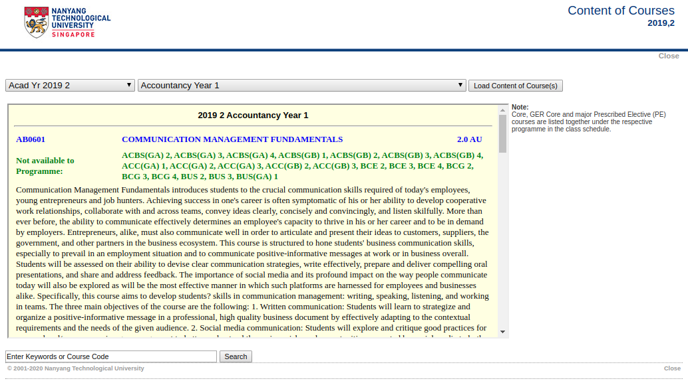
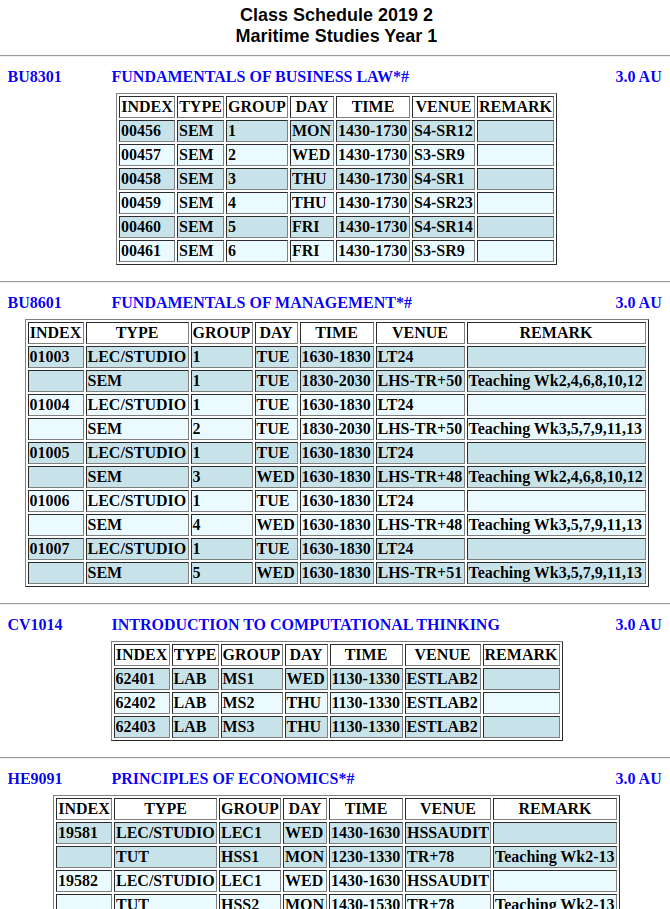
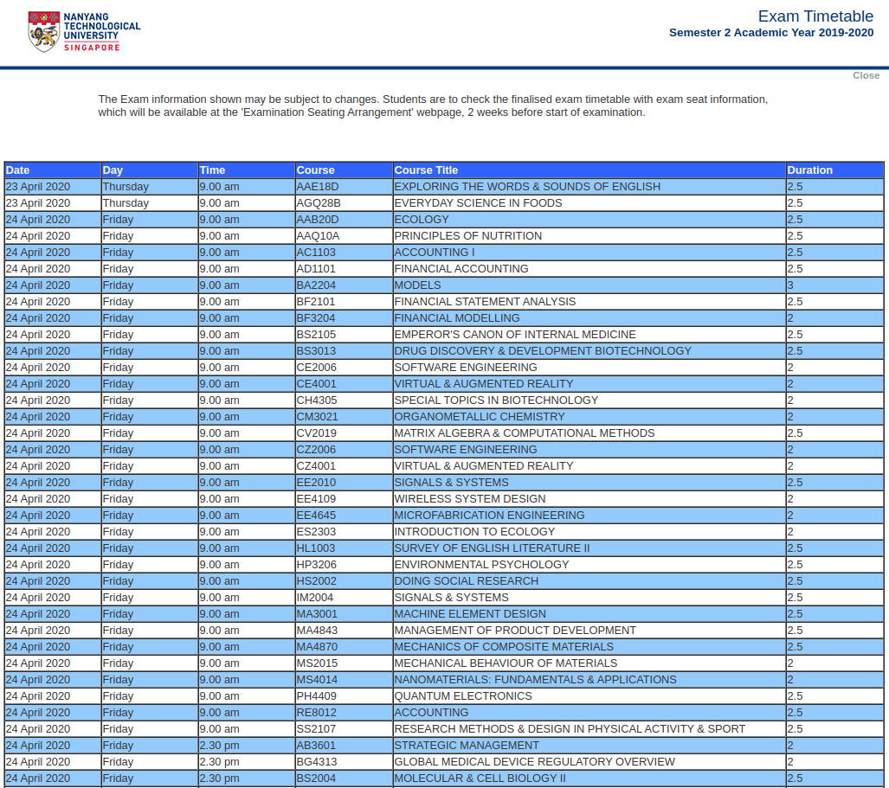

## Data Sources

This document describes the type of data available on various public sources.

### 1. Content of Courses [[source]](https://wish.wis.ntu.edu.sg/webexe/owa/aus_subj_cont.main) [[screenshot]](#screenshot-course)

Displays the list of modules filtered by `Acad Year and Semester` and `Programme`.
  - Up to `3` academic years of information is available. Each academic year has `4` semesters (1, 2, Special Term I, Special Term II).
  - Programmes are listed under `6` categories (Full-Time Degree, Double Degree, Minor, General Education, C N Yang Scholars Programme, Unrestricted Electives)
  - For each academic year and semester, a common `Note` is displayed on the right of the web page explaining that Core, GER Core and major Prescribed Elective (PE) modules are listed together under each respective programme. Occasionally, additional updates may be included under the `Note` (See Acad Yr 2019 1)
  - [Understanding NTU's Course Structure](https://digitalsenior.sg/ntu-freshmen-guide-how-to-survive-your-freshmen-year/

With any combination of `Academic Year and Semester` and `Programme` selected, a list of modules will be loaded. Each modules may contain the following fields:
| Field | Example(s) |
| - | - |
| Course code* | `CZ1007` |
| Title* | `Data Structures` |
| Description* | `Syntactic and Semantics of basic constructs in C? language; Data aggregates; Control Abstraction; Linear Structures; Recursion; Implementing the Tree Abstraction;` |
| Credit* | `3.0` |
| Grade Type | `Pass/Fail` |
| Prerequisite | 1. `CE1008 OR CZ2008 OR CE1011 & CE1012 OR CZ1011 & CZ1012` 2. `AC2101(Corequisite) & AC2104 & AC2401(Corequisite)` 3. `HE2004 (Min Grade :A) (Applicable to ECPP) OR HE2005 & HE9091 (Not Applicable to ECON)` 4. `for students who fail QET` 5. `Only opened to NBS students.` 5. `Physically active.No injuries/medical conditions.` 6. `For students w/o A level Physics(applicable to F/T students)`  Sometimes there are 2 rows of prerequisite, one with list of modules and one with a generic string (e.g. AB0502) |
| Mutually Exclusive With | `CZ1007, CH0494, CV0003` |
| Not Available To Programme | 1. `BCG, CSC, EEE, REP(CSC)` 2. `CEE(2019-onwards)(Direct Entry),CEE(2019-onwards)(Non Direct Entry))` |
| Not Available as UE to Programme | `BCE, EEE` |
| Not Available as Core to Programme | `MS-2ndMaj/Spec(ITG)(2016-onwards), MS-2ndMaj/Spec(MSB)(2016-onwards)` |
| Not Available To All Programme With | 1. `(admyr 2001-2017)-Non Direct Entry, (Admyr 2011-2018)-Direct Entry)` 2. `Yr1` |

\* Mandatory Field

### 2. Class Schedule [[source]](https://wish.wis.ntu.edu.sg/webexe/owa/aus_schedule.main) [[screenshot]](#screenshot-class)

Displays the list of class schedule for each module filtered by `Acad Year and Semester` and `Programme`.
  - Up to `6` academic years of information is available. Each academic year has `4` semesters (1, 2, Special Term I, Special Term II).
  - Programmes are listed under `8` categories (Full-Time Degree, Double Degree, Part Time Degree, Minor, General Education, English Proficiency, C N Yang Scholars Programme, Unrestricted Electives)
  - For each academic year and semester, a common `Attention` (Same as `Note` from [Content of Courses](#content-of-courses)) is displayed on the right of the web page explaining that Core, GER Core and major Prescribed Elective (PE) modules are listed together under each respective programme, and an additional instruction to students who intend to register course HW310.

With any combination of `Academic Year and Semester` and `Programme` selected, a list of class schedules will be loaded. Each class schedule may contain the following fields:
| Field | Example(s) |
| - | - |
| Course code* | `CZ1007` |
| Title* | `Data Structures`   Optionally followed by any combination of `*`, `^`, or `#` (e.g `*`, `*#`) which denotes: `*` = Course is available as Unrestricted Elective `^` = Self - Paced Course `#` = Course is available as General Education Prescribed Elective |
| Credit* | `3.0` |
| Remark 1 (displayed in pink text) | 1. `for students who fail QET` 2. `Open to & Compulsory for SCECSCstudents from AY2011-12 only.` 3. `AB1000 is scheduled in RECESS WEEK ONLY` |
| Prerequisite | 1. `HW0001(Corequisite)` 2. `HW001 OR HW0001` 3. `HE2001 & HE2002 OR HE201 & HE202` 4. `HE201 OR HE192 OR MAS112 (Applicable to MAEC) & MAS113 (Applicable to MAEC) OR HE201 (Applicable to MAEC) & MTH112 (Applicable to MAEC) & MTH113 (Applicable to MAEC) OR HE2001 OR HE9092` |
| Index* | `58001`, `58001`, `50883` |
| Type* | `LEC/STUDIO`, `TUT`, `LAB`, `SEM` |
| Group* | 1. `1, ..., 10` 2. `C20, ..., C25` 3. `GP1, ..., GP16` 4. `SSP1, ... SSP4` 5. `LE`, `SCE`  Generally in the format of `numeric`, `alphabets` or `alphanumeric`. For `alphanumeric`, format is one or more alphabets followed by one or more digits. Pattern does not alternate between alphabets and numbers.  The matching regular expression for a `Group` is as such: `[0-9]+\|[A-Z][A-Z]+\|[A-Z]+[0-9]+` |
| Day* | `MON`, `TUE`, `WED`, `THU`, `FRI`, `SAT`, `SUN` |
| Time* | `1000-1200` |
| Venue* | 1. `LT18` 2. `HSSSEMRM9` 3. `CS-TR+7` |
| Remark 2 (last column in the table) | 1. `Teaching Wk2-13` 2. `Teaching Wk2,4,6,8,10,12` 3. `Teaching Wk3,5,7,9,11,13` 4. `Not conducted during Teaching Weeks Recess week only` |

\* Mandatory Field

### 3. Exam Timetable [[source]](https://wis.ntu.edu.sg/webexe/owa/exam_timetable_und.main) [[screenshot]](#screenshot-exam)

Displays the list of exam schedule for the current semester. Note that information shown may be subject to changes. Students are advised to check the finalized exam timetable with exam seat information on the [Examination Seating Arrangement webpage](https://www.ntu.edu.sg/Students/Undergraduate/AcademicServices/Examination/Pages/ExamSeatingArrangements.aspx) which is released 2 weeks before start of examination.

From [source](https://wis.ntu.edu.sg/webexe/owa/exam_timetable_und.main), navigate to the complete list of exam timetable as follow (you should see a page like [this](#screenshot-exam)):
1. Select `General Access` and click `Next`
2. Select `AY2019-20 SEM 2` (not the _SELF-PACED_ one) and click `Next`.
3. Click `Next` again. (Leave `Date`, `Time`, `Dept Code`, `Course` selected as `All`)

Each exam schedule contains the following fields:

| Field | Example(s) |
| - | - |
| Date* | `23 April 2020` |
| Day* | `Thursday` |
| Time* | `9.00am`, `1.00pm`, `2.30pm`, `5.00pm` |
| Course* | `AAE18D` |
| Course Title* | `EXPLORING THE WORLDS & SOUNDS OF ENGLISH` |
| Duration* | `2`, `2.5`, `3` |

\* Mandatory Field

## Appendix

#### Screenshot of Content of Courses

#### Screenshot of Class Schedule

#### Screenshot of Exam Timetable

