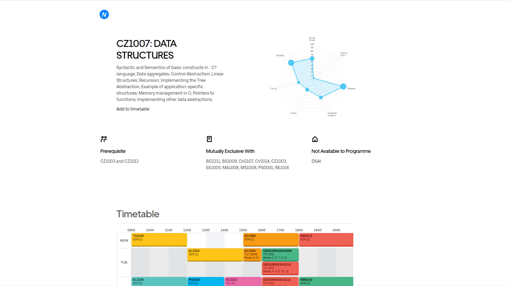
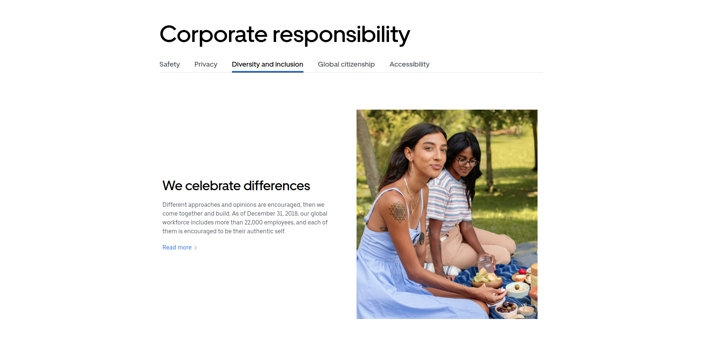

# Mockups

## Logo

The .drawio file to modify the logo is available [here](../ntumods_logo.drawio).

Steps to re-create the logo:
1. Under `General`, click on `Circle` and a circle shape should appear on canvas
1. Scale the circle size to `300` x `300`
1. Fill circle with the color `007FFF`
1. Uncheck `Line`
1. Double click on circle and add a text `N`
1. Set font type tp `Helvetica`
1. Set font style to both `bold` and `italic`
1. Set font size to `230` pt
1. Set font alignment to `center`

## Modules List Entry [[uber reference]](https://www.uber.com/)

## Module List

## Horizontal Bar Design

## API Reference
Here's where our API reference lives [here](https://ntumods.com/api).